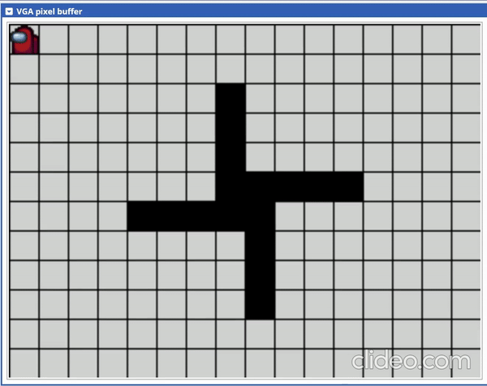

# ecse324-game-of-life-armv7
This project is a basic game of life implementation in assembly ARMv7 done for ECSE 324

The code was developed and tested on this [emulator](https://ecse324.ece.mcgill.ca/simulator/?sys=arm-de1soc).

## Features
- Custom graphics driver
- Custom keyboard driver
- Cursor (the among us icon) controlled by keyboard inputs
- Game of life logic

## How to use
- Load the program into the [emulator](https://ecse324.ece.mcgill.ca/simulator/?sys=arm-de1soc)
- Compile the program by pressing on "Compile and Load"
- Run the program by pressing on "Continue" or using the shortcut F3
- In the device section, use the PS/2 keyboard or mouse peripheral to input keyboard commands. Use WASD to move the cursor, the spacebar to toggle the state of the currently selected cell, and N to iterate to the next grid state using the game of life logic.
